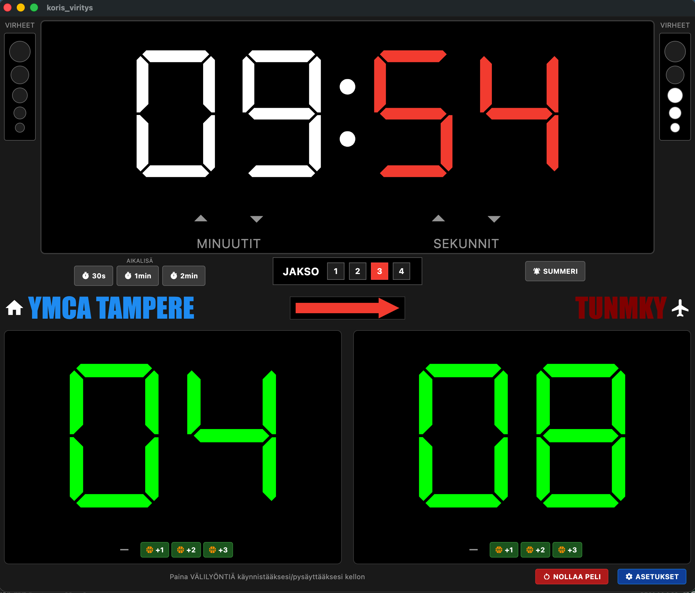

# Koris Viritys

A virtual basketball scoreboard for macOS, built with Flutter.



## Features

- Game clock with start/stop and per-quarter reset
- Score tracking with +1, +2, +3 buttons
- Team foul counters with penalty indication (6+)
- Period selector (1–4) with halftime timer
- Timeout timers (30s, 1min, 2min)
- Possession arrow toggle
- Buzzer sound on clock expiry and manual trigger
- Undo support (up to 30 actions)
- Team name and color customization

## Run

```bash
flutter run -d macos
```

## Build

```bash
flutter build macos --release
```

The app bundle will be at `build/macos/Build/Products/Release/koris_viritys.app`.
