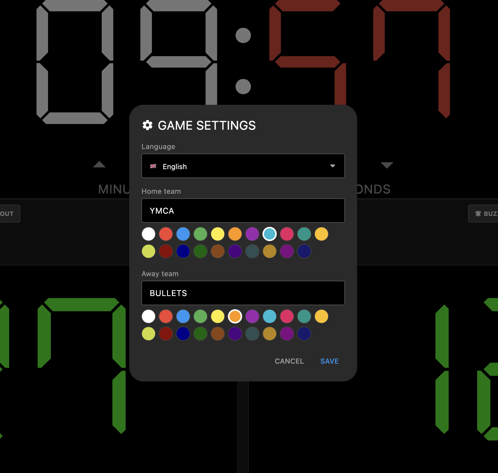

# Korisviritys

A virtual basketball scoreboard for macOS, iPad, and web.

**Scoreboard**


<br>

**Settings**



## Features

- Game clock with start/stop (tap the clock or press Space)
- Score tracking with +1, +2, +3 buttons
- Team foul counters with penalty indication (6+)
- Period selector (1–4) with halftime timer
- Timeout timer with selectable duration (30s, 1min, 2min)
- Possession arrow toggle
- Buzzer sound on clock expiry and manual trigger
- Undo support (up to 30 actions)
- Custom halftime duration — pick a preset or enter any time in minutes
- Team name and color customization
- Multi-language support (16 languages) — English, Suomi, Svenska, Eesti, Latviešu, Lietuvių, Русский, Deutsch, Español, Français, Italiano, Ελληνικά, Türkçe, Српски, Hrvatski, Slovenščina
- iOS-style press feedback on all buttons
- Persistent state — game survives refresh/restart, clock adjusts for time elapsed while closed

## Keyboard Shortcuts

| Key       | Action                 |
| --------- | ---------------------- |
| Space     | Start/stop clock       |
| 1 / 2 / 3 | +1 / +2 / +3 home team |
| 8 / 9 / 0 | +1 / +2 / +3 away team |

## Run

```bash
make run        # macOS
make run-ipad   # iPad simulator
make run-web    # Chrome
```

## Build

```bash
make build      # macOS (copies to /Applications)
make build-web  # Web (output in build/web, serve with: serve build/web)
```
